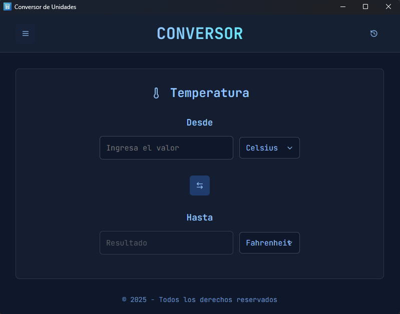
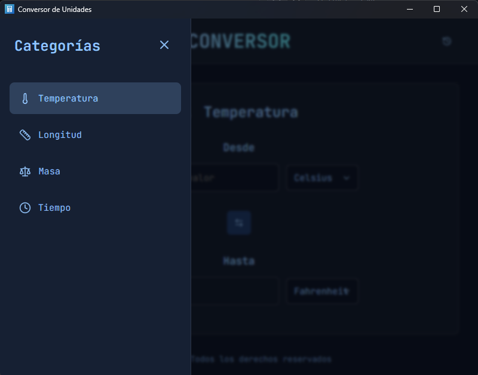
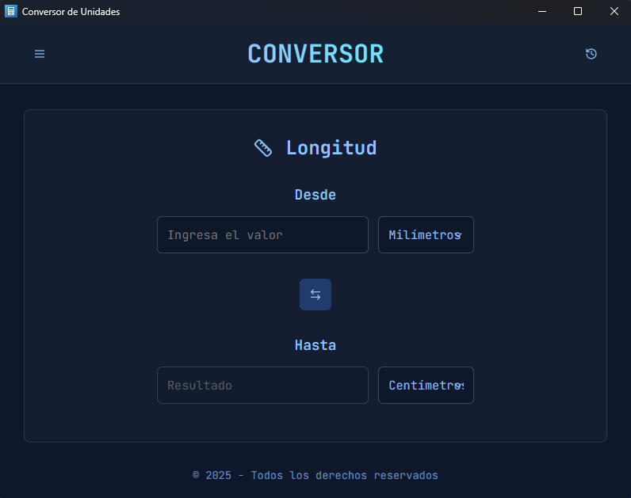
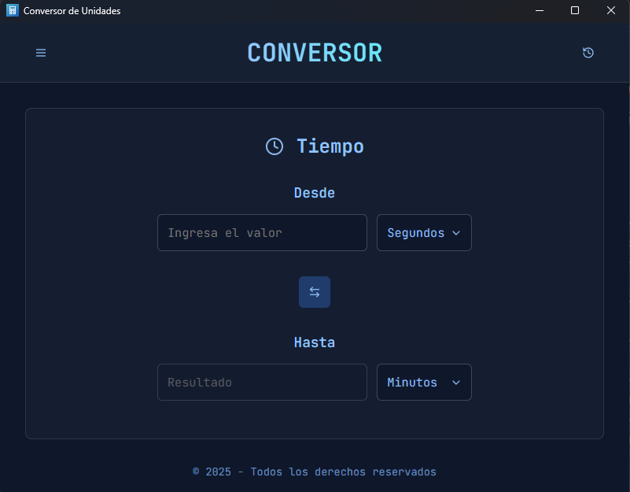
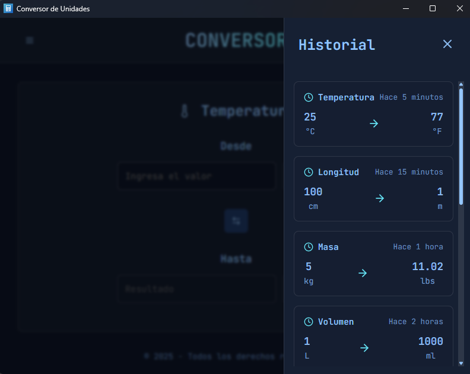

# 🔄 Units Conversor

> Desktop unit converter built with Tauri, React, and TypeScript.

   

## 📋 Table of Contents
- [Overview](#-overview)
- [Features](#-features)
- [Screenshots](#-screenshots)
- [Installation](#-installation)
- [Development](#️-development)
- [Tech Stack](#-tech-stack)
- [Project Structure](#-project-structure)
- [Academic Context](#-academic-context)
- [License](#-license)

## 🎯 Overview

**Units Conversor** is a desktop app for quick and accurate unit conversions. It was built for day-to-day use in study and technical work, with a simple interface and real-time results.

### Why Units Conversor?
- ✅ **Offline**: No internet connection required.
- ⚡ **Real-time conversion**: Results update while you type.
- 🎨 **Clean UI**: Dark-themed and easy to navigate.
- 🔄 **Useful extras**: Unit swap and conversion history.
- 🛡️ **Solid desktop base**: Powered by Tauri + Rust.

## ✨ Features

### 🌡️ **Temperature**
- Celsius (°C), Fahrenheit (°F), Kelvin (K)

### 📏 **Length**
- Metric (mm, cm, m, km) and Imperial (in, ft, yd, mi)

### ⚖️ **Weight**
- Milligrams (mg), Grams (g), Kilograms (kg), Ounces (oz), Pounds (lb), Tons (t)

### ⏰ **Time**
- Seconds, Minutes, Hours, Days, Weeks, Months, Years

## 📸 Screenshots

Real screenshots of the desktop app:

### Home


### Categories Sidebar


### Length Converter


### Mass Converter


### Time Converter


### Conversion History


## 💾 Installation

### For Windows Users

1. **Download the installer**:
   - Go to the [Releases](https://github.com/YeralAndre/units-conversor/releases) page.
   - Download the latest `.msi` or `setup.exe` file.
2. **Install**:
   - Double-click the downloaded file and follow the installation wizard.
3. **Run**:
   - Find "Units Conversor" in your Start Menu and enjoy!

## 🛠️ Development

### Prerequisites
- [Node.js](https://nodejs.org/) (v18+)
- [Rust](https://rustlang.org/) (Latest stable)
- [pnpm](https://pnpm.io/)

### Setup
```bash
# Clone the repository
git clone https://github.com/YeralAndre/units-conversor.git
cd units-conversor

# Install dependencies
pnpm install

# Run in development mode
pnpm tauri dev
```

## 🏗️ Tech Stack

- **Frontend**: React 18, TypeScript, CSS3 (Custom variables), Lucide React (Icons).
- **Backend/Desktop**: Tauri (Rust-based framework), WebView.
- **Build Tools**: Vite, ESLint, pnpm.

## 📁 Project Structure

```text
units-conversor/
├── src/                 # React frontend
│   ├── components/      # UI components
│   ├── lib/             # Conversion logic
│   ├── conversors.json  # Converter definitions
│   ├── App.tsx
│   └── main.tsx
├── src-tauri/           # Rust + Tauri backend
├── public/
└── screenshots/
```

## 🎓 Academic Context

This project was developed for a university assignment focused on combining modern web development with systems programming (Rust) in a desktop app.

## 📄 License

This project is licensed under the MIT License - see the [LICENSE](LICENSE) file for details.

---
Developed by [Yeral Andre](https://github.com/YeralAndre)
